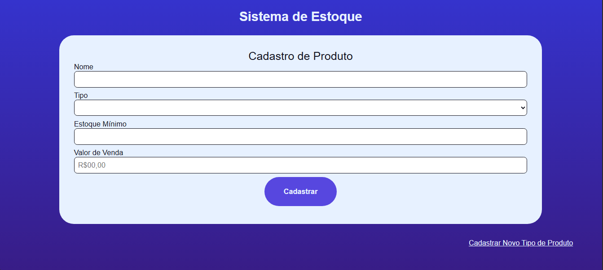
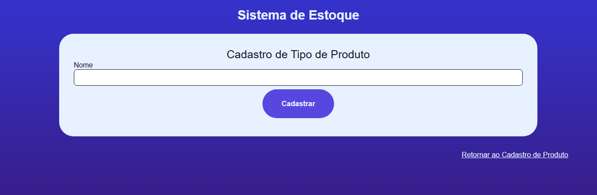

# Sistema de Estoque
**Criado para a disciplina:** Modelagem e Projeto de Sistemas (4º período de Engenharia da Computação)  
**Data de criação:** 08/12/2024
**Última atualização:** 25/01/2025 

Este projeto é um protótipo de sistema para controle de estoque, desenvolvido como parte de uma disciplina acadêmica. Seu principal objetivo foi implementar funcionalidades básicas de cadastro e controle de produtos, além de validar o alinhamento entre o desenvolvimento e as documentações criadas durante o processo.

## Funcionalidades
- **Cadastro de Produtos:** Permite vincular produtos a tipos específicos e armazená-los em uma tabela no banco de dados.
- **Cadastro de Tipos de Produto:** Gerencia categorias que organizam os produtos.
- **Regras de Negócio:** Validação de entradas de dados, como formato aceitável para nomes, tipos e valores.
- **Banco de Dados:** Movimentações realizadas com persistência utilizando SQLite3.

## Tecnologias Utilizadas
- **HTML5 e CSS3:** Para a interface funcional do sistema.
- **Python:** Para a lógica principal do backend.
  - **Flask:** Framework utilizado para o desenvolvimento do backend.
  - **SQLite3:** Banco de dados leve para armazenamento das informações.

## Interface e Design
A interface foi desenhada com foco em funcionalidade e simplicidade, priorizando o cumprimento dos requisitos estabelecidos. Embora o design não seja o ponto forte do projeto, ele atende aos objetivos acadêmicos e funcionais.
- Tela principal - Cadastro de Produtos

- Cadastro de Tipos de Produto


## Estrutura do Projeto
```plaintext
sistema-estoque/
├── .venv/                      # Ambiente virtual com dependências do framework Flask
├── static/                     # Arquivos estáticos como CSS e imagens
│   └── img/                    # Imagens
│   └── style.css               # Estilos básicos para a interface
├── templates/                  # Arquivos HTML usados pelo Flask
│   ├── index.html              # Página inicial
│   ├── cadastro_produto.html   # Tela de cadastro de produtos
│   └── cadastro_tipo.html      # Tela de cadastro de tipos de produto
├── main.py                     # Arquivo principal do Flask
├── produtos.db                 # Banco de dados SQLite3 para armazenamento de produtos
├── tipoProdutos.db             # Banco de dados SQLite3 para armazenamento de tipos de produto
└── README.md                   # Documentação do projeto
```

## Melhorias Futuras
- Refinar o design da interface, tornando-a mais moderna e visualmente atraente;
- Implementar página para consulta de produtos e tipos cadastros;
- Criar relatórios gerenciais para análise de estoque;
- Adicionar autenticação de usuários para maior segurança;
- Adicionar controle de movimentação de estoque por compra e venda;
- Adicionar cadastro e controle de funcionários do estoque vinculado ao login.

## Como Executar
1. Clone este repositório:
   ```bash
   git clone https://github.com/IRGarrido/SistemaDeEstoque.git
   ```
2. Instale as dependências necessárias:
   ```bash
   pip install flask
   ```
3. Execute o servidor:
   ```bash
   python main.py
   ```
4. Acesse o sistema em `http://localhost:5000`.

## Contribuições
Contribuições são bem-vindas! Para sugerir melhorias ou reportar problemas, abra uma [issue](https://github.com/seu-usuario/sistema-estoque/issues) ou envie um [pull request](https://github.com/seu-usuario/sistema-estoque/pulls).

## Autor
- Diana Maria Da Camara Gorayeb (orientadora);
- Gustavo da Costa Frota;
- Ian Garrido Reis;
- Pedro Vitor Barros Maranhão.

